# Sistema de Inventario en Python

## Descripción

Este proyecto es un sencillo sistema de inventario escrito en Python. Se trata de una aplicación de consola que permite al usuario registrar productos, incluyendo su **nombre, precio y cantidad**.

El programa está diseñado para **programadores principiantes** que están aprendiendo Python. Muestra cómo trabajar con **bucles, entrada de datos por parte del usuario y validación de datos**.

---

## Diagrama de flujo

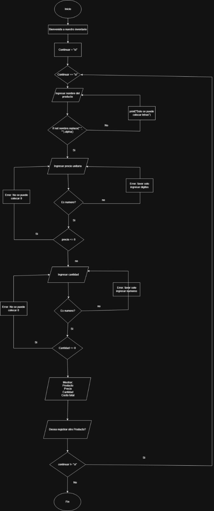

---

## Requerimientos
- Python 3.x

- Git

## Instalación y ejecución del proyecto

### 1. Verificar que git este instalado

Git es necesario para clonar el repositorio.

#### Verificar si Git está instalado
Abre la terminal y escribe:

```bash
git --version
```
Si aparece algo como:
```bash
git version 2.x.x
```

significa que Git está instalado correctamente.

#### Si no tienes Git instalado

1. Ve a la página oficial: https://git-scm.com

2. Haz clic en Download y selecciona tu sistema operativo (Windows, macOS o Linux)

3. Ejecuta el instalador descargado

4. Durante la instalación, deja las opciones predeterminadas a menos que necesites configuraciones específicas

5. Para comprobar que la instalación funcionó, abre la terminal y vuelve a ejecutar:

```bash
git --version
```

---

### 2. Clonar el repositorio

Primero debes abrir la terminal. Puedes hacerlo desde el escritorio haciendo clic derecho sobre la pantalla y seleccionando **"Abrir terminal"**.

Luego, en la terminal, ejecuta el siguiente comando:

```bash
git clone https://github.com/Nesdael/Inventario.git
```

Después entra a la carpeta del repositorio con:

```bash
cd Inventario
```

---

### 3. Verificar que Python esté instalado

En la terminal escribe:

```bash
python --version
```

Si aparece algo como:

```
Python 3.x.x
```

significa que Python está instalado correctamente.

#### Si no tienes Python instalado

1. Ve a la página oficial: https://www.python.org
2. Haz clic en **Download Python**
3. Ejecuta el instalador descargado
4. Marca la opción **Add Python to PATH**
5. Haz clic en **Install Now**

---

### 3. Ejecutar el programa

Para ejecutar el programa principal usa:

```bash
python3 inventario.py
```

El programa se verá así:

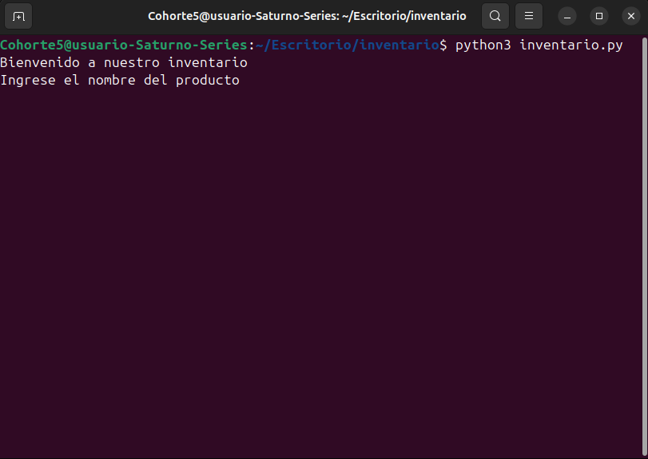

---

## Funciones

* Registrar productos en el inventario
* Validar el nombre del producto
* Validar el precio
* Validar la cantidad
* Generar una factura simple
* Calcular el costo total de los productos

---

## Ejecución del Sistema de Inventario en la Terminal

1. Mensaje de bienvenida e Ingreso del nombre del producto

Cuando el programa se inicia:

```bash
$ python3 inventario.py
```


El programa solicita el nombre:

Ingrese el nombre del producto
> Manzanas

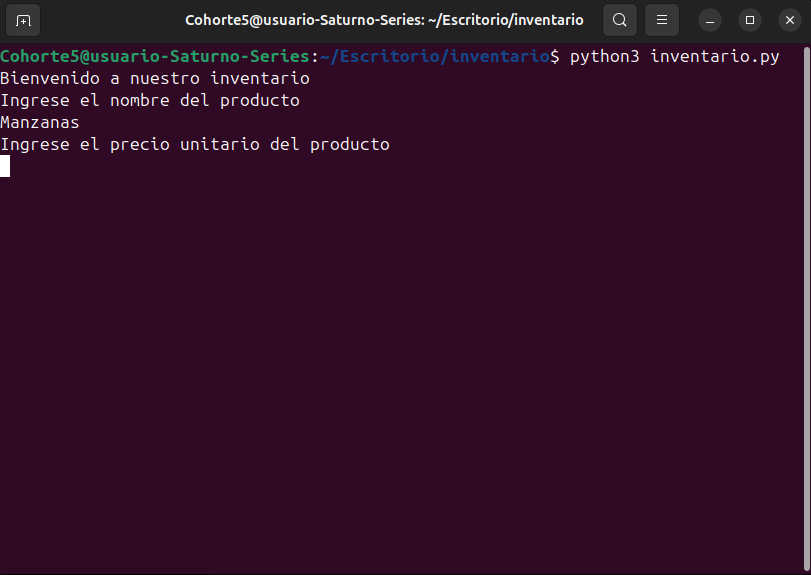

Si el usuario escribe algo inválido, por ejemplo `“Manzanas123”`:

Ingrese el nombre del producto
> Manzanas123
Error: El nombre solo debe contener letras

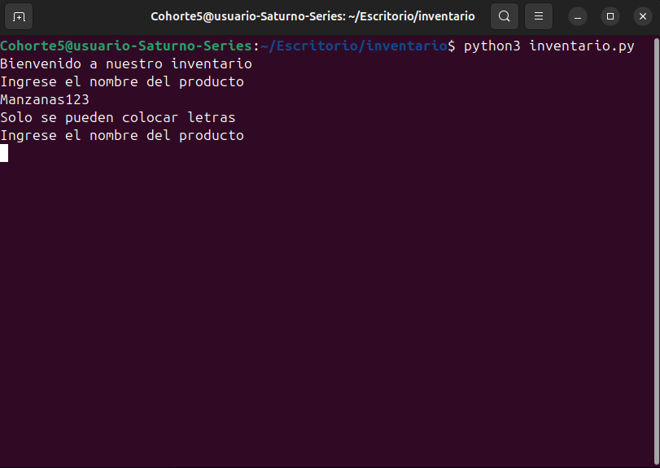
Ingrese el nombre del producto
> Manzanas

3. Ingreso del precio

El programa pide el precio unitario:

Ingrese el precio unitario del producto
> 2500.50

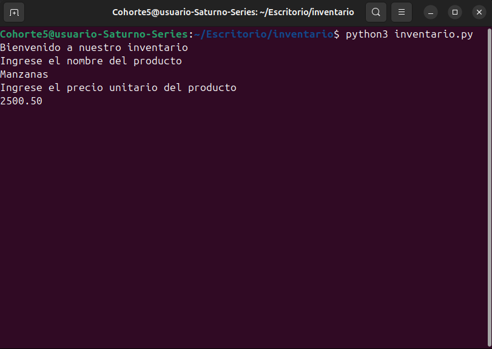

Si el usuario ingresa algo inválido o negativo:

Ingrese el precio unitario del producto
> -3

Debe ingresar un número positivo
Ingrese el precio unitario del producto
> abc
Debe ingresar un número válido

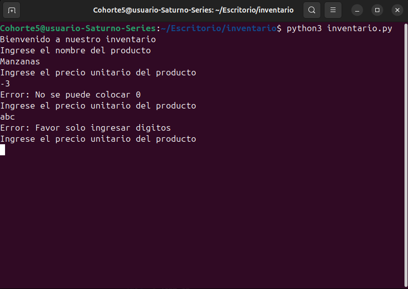

Ingrese el precio unitario del producto
> 2500.50

4. Ingreso de la cantidad

El programa solicita cuántas unidades del producto:

Ingrese la cantidad que desea del producto
> 4

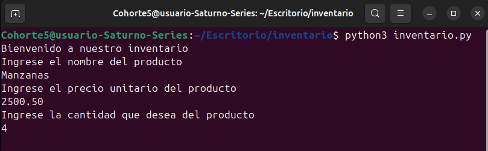

Si el usuario ingresa algo no entero o negativo:

Ingrese la cantidad que desea del producto
> -2
Debe ingresar un número positivo
Ingrese la cantidad que desea del producto
> 3.5
Debe ingresar un número entero válido

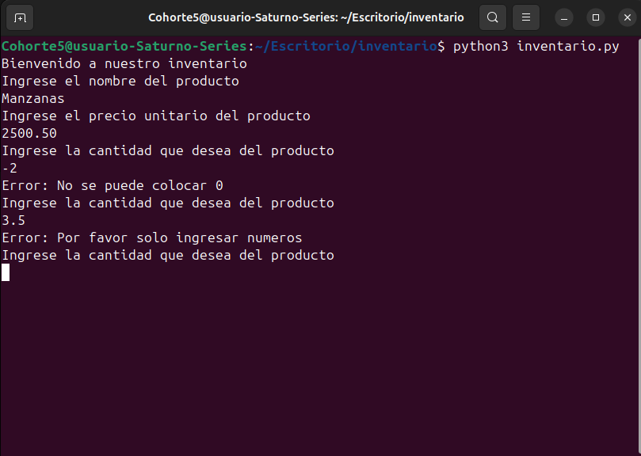

Ingrese la cantidad que desea del producto
> 4

5. Mostrar la factura

Después de ingresar todos los datos, el programa muestra algo así:

Factura
Producto: Manzanas | Precio: 2500.50 | Cantidad: 4
Costo total de los productos: 10002.00

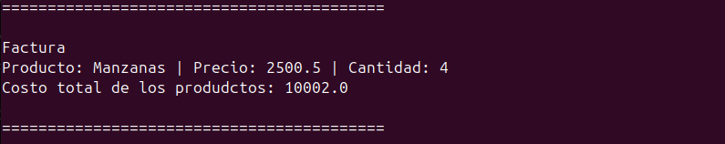

6. Preguntar si desea agregar otro producto

El programa pregunta si quieres seguir:

¿Desea registrar otro producto? (si/no): si

Si escribes “si”, vuelve a pedir el nombre de un nuevo producto.

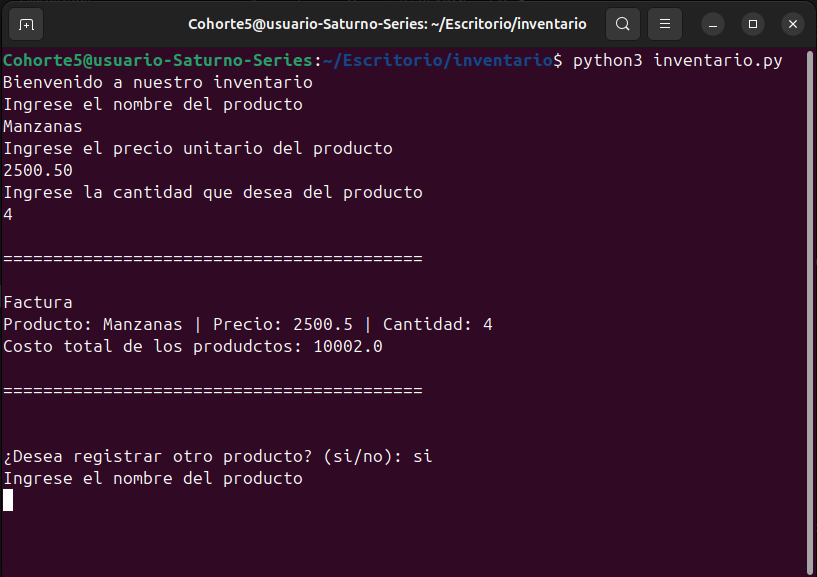

Si escribes “no”:

Gracias por utilizar nuestro inventario

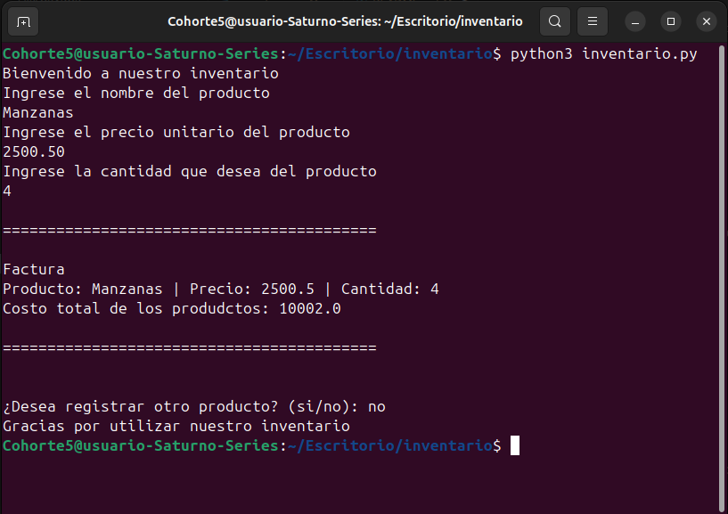

Y finaliza el porgrama

## Explicación del código

El programa es un sistema de inventario sencillo que funciona en la terminal. Permite al usuario registrar productos ingresando su **nombre, precio y cantidad**, para luego generar una **factura simple con el costo total**.


1. En vez de entrar de inmediato en cada línea, puedes explicar paso a paso:

2. El programa saluda al usuario.

3. Pregunta el nombre del producto y verifica que solo contenga letras.

4. Pide el precio y la cantidad, asegurándose de que sean números positivos.

5. Calcula el costo total y muestra la factura.

6. Pregunta si quiere registrar otro producto.

7. Si la respuesta es "no", sale del programa y deja un mensaje de despedida
---

### 1. Mensaje de bienvenida

```python
print("Bienvenido a nuestro inventario")
```

Esta línea muestra un mensaje inicial al usuario cuando se ejecuta el programa.

### 2. Variable de control del programa
```python
continuar = "si"
```
Se crea una variable llamada `continuar` que se utiliza para controlar si el programa debe seguir ejecutándose o terminar.

### 3. Bucle principal del programa
```python
while continuar == "si":
```
Este bucle permite que el programa se repita para registrar varios productos.
Mientras la variable continuar tenga el valor `"si"`, el programa seguirá solicitando información al usuario.

### 4. Ingreso del nombre del producto
```python
nombre = str(input("Ingrese el nombre del producto\n"))
```
Aquí se le pide al usuario que ingrese el nombre del producto utilizando la función `input()`.

### 5. Validación del nombre
```python
if not nombre.replace(" ", "").isalpha():
```
Esta condición verifica que el nombre del producto contenga **solo letras y espacios**.

`.replace(" ", "")` elimina los espacios del texto.

`.isalpha()` verifica que todos los caracteres sean letras.

Si el usuario introduce números o símbolos, el programa mostrará un mensaje de error y volverá a pedir el dato.

### 6. Validación del precio
```python
while True:
    try:
        precio = float(input("Ingrese el precio unitario del producto\n"))
```

En esta parte del programa se solicita el precio del producto.

Se utiliza:

`float()` para permitir números decimales.

`try/except` para evitar que el programa se detenga si el usuario escribe texto u otro valor inválido.

También se valida que el precio no sea menor o igual a cero.

### 7. Validación de la cantidad
```python
cantidad = int(input("Ingrese la cantidad que desea del producto\n"))
```
Aquí el usuario ingresa la cantidad del producto.

`int()` se usa porque la cantidad debe ser un número entero.

También se usa `try/except` para evitar errores si el usuario introduce valores incorrectos.

### 8. Cálculo del costo total
```python
total_costo = precio * cantidad
```
El programa calcula el costo total multiplicando el precio unitario por la cantidad del producto.

### 9. Mostrar la factura
```python
print("Factura")
print(f"Producto: {nombre.capitalize()} | Precio: {round(precio, 2)} | Cantidad: {cantidad}")
print(f"Costo total de los productos: {total_costo}")
```

El programa muestra una factura simple que contiene:

- Nombre del producto

- Precio unitario

- Cantidad

- Costo total

Funciones utilizadas:

`capitalize()` convierte la primera letra del nombre en mayúscula.

`round()` redondea el precio a dos decimales.

### 10. Preguntar si se desea registrar otro producto
```python
continuar = input("\n¿Desea registrar otro producto? (si/no): ").lower()
```
El programa pregunta al usuario si desea registrar otro producto.

La función `.lower()` convierte la respuesta a minúsculas para evitar errores si el usuario escribe `"SI"` o `"Si"`.    

### 11. Mensaje de salida
```python
print("Gracias por utilizar nuestro inventario")
```
Si el usuario decide no continuar registrando productos, el programa finaliza mostrando un mensaje de despedida.

## Autor

- Nestor D. Duran F.